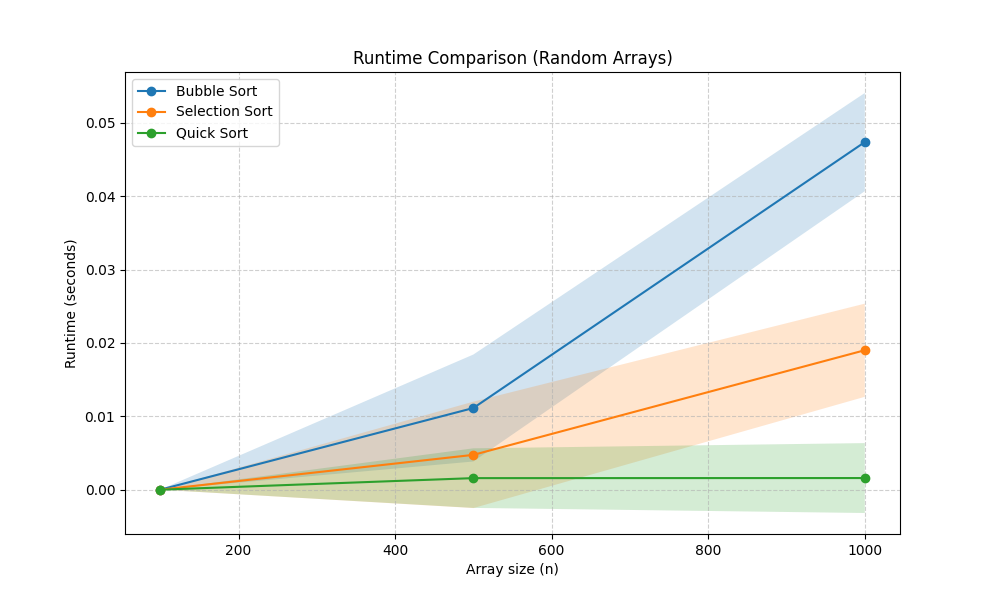
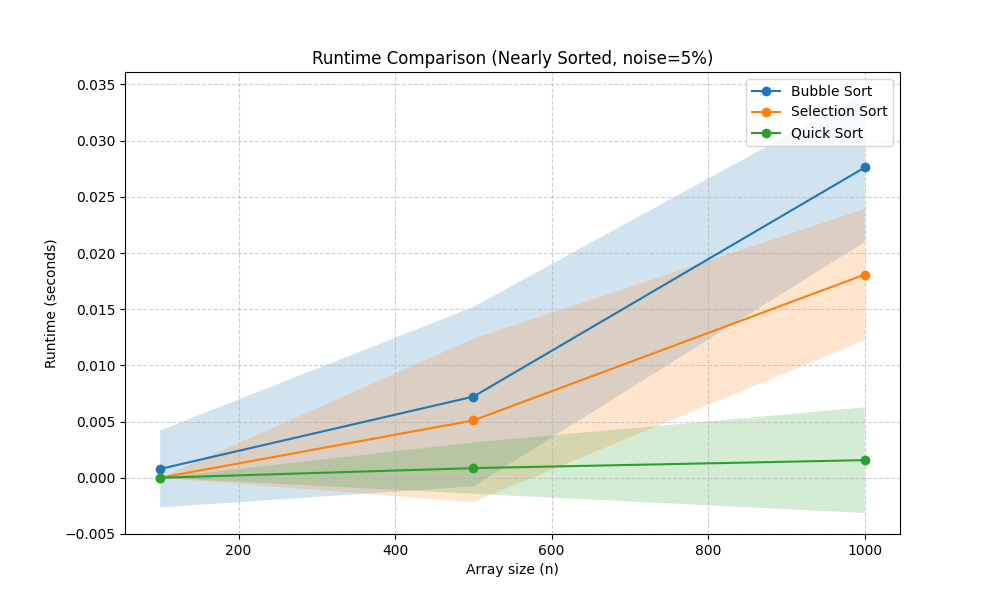

  <div align="center">
    
# Sorting_Assignment - ניתוח אלגוריתמי מיון

<div dir="rtl">
  
## פרטי הסטודנט
* **שם:** אסף מוסקוביץ 
* **קורס:** מבני נתונים - אביב 2026 

## אלגוריתמי המיון שנבחרו
במסגרת המטלה, בחרתי להשוות בין שלושת האלגוריתמים הבאים:
1. **Bubble Sort** (מיון בועות) - אלגוריתם המבוסס על החלפת זוגות סמוכים. 
2. **Selection Sort** (מיון בחירה) - אלגוריתם המוצא את המינימום ומציבו בתחילת המערך.
3. **Quick Sort** (מיון מהיר) - אלגוריתם "חלק וכבוש" המשתמש באיבר ציר (Pivot).

---

## תוצאות ניסוי 1: מערכים אקראיים (result1.png)

<div align="center">
  
</div>

### הסבר התוצאות:
בגרף זה ניתן לראות בבירור את ההבדל בין קצבי הצמיחה (Growth Rates) של האלגוריתמים:
* **Bubble Sort ו-Selection Sort:** מציגים עקומה פרבולית התואמת את הסיבוכיות התאורטית שלהם במקרה הממוצע - O(n^2). ניתן להבחין ש-Bubble Sort איטי יותר מ-Selection Sort בשל העומס של ביצוע החלפות (Swaps) רבות בזיכרון בכל איטרציה.
* **Quick Sort:** נראה כמעט שטוח בהשוואה לאחרים. זאת מכיוון שהסיבוכיות שלו היא O(n*log(n)), מה שמאפשר לו לטפל במערכים גדולים משמעותית בזמן קצר מאוד.

---

## תוצאות ניסוי 2: מערכים כמעט ממוינים (result2.png)

<div align="center">
  
</div>

### הסבר התוצאות והשפעת ה"רעש": 
בניסוי זה בדקנו כיצד רעש (החלפות אקראיות של 5% או 20% מהאיברים) משפיע על הביצועים:
* **Selection Sort:** זמן הריצה לא השתנה משמעותית. הסיבה לכך היא שאלגוריתם זה מבצע תמיד את אותה כמות השוואות (O(n^2)) כדי למצוא את המינימום, ללא קשר למידת המיון המוקדמת של המערך.
* **Bubble Sort:** נשאר איטי (O(n^2)). למרות שהמערך "כמעט" מוכן, האלגוריתם עדיין נדרש לבצע סריקות רבות כדי לוודא שאין איברים לא ממוקמים.
* **Quick Sort:** נותר המהיר ביותר. השימוש באיבר ציר מהאמצע (Middle Pivot) עוזר לו לשמור על יעילות של O(n*log(n)) גם כשהמערך קרוב להיות ממוין.

---

## הוראות הרצה
ניתן להריץ את הניסויים דרך שורת הפקודה (CLI) באופן הבא:
</div>

```bash
python run_experiments.py -a 1 2 5 -s 100 500 1000 3000 -e 1 -r 20
